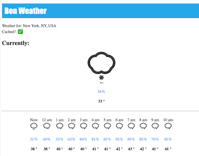

# Ben Weather

### README



Uses Ruby 3 and Rails 8. For a production deploy you'd likely want to hook up redis or another
similar cache instead of using memory or DB store for caching the addresses and weather forecasts.

Makes external API calls to Google for geolocation data and Pirate Weather for weather forecasts.

Before launching the server or running tests, add API key credentials for Google and Pirate Weather

```
rails credentials:edit
```

To run tests:

```
bundle exec rails spec
```

To launch the server:

```
bundle exec rails server
```

### Notes

Rails is probably overkill for this project since a database and ActiveRecord aren't utilized,
and we also only have a single controller.

If we wanted to scale this for high usage, we could look at a technique like employing a database
or large cache to store geolocation coordinates for various address inputs so that repeated
lookups are permanently cached for the geolocation service results to avoid repeatedly
querying the google maps API, since in theory, those will almost never change (at least in the US).

Alternatively you could have a cron job service of sorts that would do this periodically.

Either of these would help reduce the amount of time we have to query two services concurrently.

30 minutes actually seems like it is a long time to cache data. I understand that is what the
requirements asked for but weather can change rapidly so if I were building this for production I
would look at reducing that time period.
